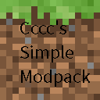

# Cccc's Simple Modpack

Hi, This is my modpack's source code. Some information is the following.

**Powered by [packwiz](https://github.com/packwiz/packwiz)**

## How To Use It?

You can refer to [Modrinth's Document](https://docs.modrinth.com/docs/modpacks/playing_modpacks/) as the modpack is for [Modrinth](https://modrinth.com/modpacks).

## About The Modpack

The Modpack is aim at better *vanilla* experience.

Apart from various optimization mods, it may include a few mods I like(eg.[Wild Firefly](https://modrinth.com/mod/wildfirefly)), but I will keep their number relatively small.

## Support Versions

Currently, the modpack supports Minecraft 1.16.5, 1.18.2, 1.19.

You can check corresponding branch to know more about them.

More versions to be supported are based on my favor.

## Fabric or Forge

Obviously, this modpack is for Fabric, and I do NOT have any intension to make a Forge version because many mods of which are just for Fabric.

## Containing Mods

**For further information, you can check [index.toml](index.toml)*

*✅ means this mod is well working in the modpack.

*⭕ means this mod has compatibility problems with some of the others (it will be specifically mark out).

*❌ means this mod doesn't have corresponding version or dosen't need it.

Expand The Mod Table

|   Mods    |   1.19    |    1.18.2    |    1.16.5    |
|-----------|-----------|-----------|-----------|
|Alternate Current|✅|✅|✅|
|Amecs|✅|✅|✅|
|Animatica|✅|✅|❌|
|Architectury API|✅|✅|✅|
|Armor Points ++ / Health Stacking|✅|✅|❌|
|AttributeFix|✅|✅|❌|
|Auditory|✅|❌|❌|
|Auto HUD|✅|✅|❌|
|bad packets|✅|✅|❌ (no need)|
|BetterBlockOutline|✅|✅|❌|
|Better Drpped Items|❌|❌|✅|
|Better Hurt Cam|✅|✅|❌|
|Better Loading Screen|✅|✅|✅|
|Better Mount HUD|✅|✅|❌|
|Better Nether Map|❌|✅|✅|
|Better Safe Bed|✅|✅|✅|
|Blanket client-tweaks|❌|✅|❌|
|Block Entity Extended Rendering|✅|✅|❌|
|Boat Item View|✅|✅|✅|
|Borderless Mining|✅|✅|✅|
|Better Recipe Book|✅|✅|✅|
|c3h6n6o6|✅|✅|❌|
|cAn i MiNe thIS bLOCk?|✅|✅|✅|
|Carpet Extra|✅|✅|✅|
|Carpet-Fixes|✅|✅|❌|
|Carpet|✅|✅|✅|
|Chat Heads|✅|✅|✅|
|Chat Lag Fix|❌|❌|✅|
|Chime|✅|✅|✅|
|CIT Resewn|✅|✅|❌|
|Client Commands|✅|✅|✅ (From GitHub)|
|Cloth API|✅|✅|✅|
|Cloth Config API|✅|✅|✅|
|Colormatic|✅|✅|✅|
|Continuity|✅|✅|❌|
|Crowmap|✅|✅|✅|
|CullLessLeaves|✅|⭕|❌|
|CustomSkinLoader|✅|✅|✅|
|DarkKore(lib of BetterBlockOutline)|✅|✅|❌|
|Debugify|✅|✅|❌|
|Delete Worlds To Trash|❌|✅|❌|
|Detail Armor Bar|✅|✅|✅|
|Don't Clear Chat History|✅|✅|✅|
|Don't Drop It!|❌|✅|✅|
|Dynamic FPS|✅|✅|✅|
|Dynamic Crosshair|✅|✅|❌|
|Dynamic Crosshair Compat|✅|✅|❌|
|Enhanced Attack Indicator|✅|✅|✅|
|Enhanced Block Entities|✅|✅|✅|
|Entity Texture Features [Fabric]|✅|✅|✅|
|Fabric API|✅|✅|✅|
|FabricCrossDimTPFix|❌|✅|✅|
|Fabric Language Kotlin|✅|✅|✅|
|FabricSkyboxes|✅|✅|✅|
|Fabrishot|✅|✅|✅|
|Falling Leaves|✅|✅|✅|
|Fastload|✅|✅|❌|
|FerriteCore|✅|✅|✅|
|ForgeConfigAPIPort|✅|✅ (No need)|❌|
|Held Item Info|✅|✅|✅|
|Horse Stats Vanilla|✅|✅|✅|
|Iceberg|✅|✅|❌|
|IMBlockerFabric|✅|✅|✅|
|Improved Fire Overlay|✅|✅|✅|
|Indium|✅|✅|✅|
|Inventory Profiles Next|✅|✅|✅|
|Iris Shaders|✅|✅|✅|
|Item Borders|✅|✅|❌|
|Item Highlighter|✅|✅|❌|
|Item Model Fix|✅|✅|✅|
|Item Scroller|❌|✅|✅|
|JSON Model Extensions|⭕ (see [WaveyCapes/issues/20](https://github.com/tr7zw/WaveyCapes/issues/20))|❌|❌|
|Know My Name!|✅|✅|❌|
|Krypton|✅|✅|✅|
|LambdaBetterGrass|✅|✅|✅|
|LambDynamicLights|✅|✅|✅|
|Language Reload|✅|✅|❌|
|LazyDFU|✅|✅|✅|
|Litematica|❌|✅|✅|
|Lithium|✅|✅|✅|
|Make Bubbles Pop|✅|✅|❌|
|malilib|❌|✅|✅|
|Map In Slot|✅|✅|❌|
|LAN World Plug-n-Play (mcwifipnp)|✅|✅|✅|
|Memory Leak Fix|✅|✅|❌|
|MiniHUD|❌|✅|✅|
|Mod Menu|✅|✅|✅|
|ModUpdater|❌|❌|✅|
|More Culling|✅|✅|❌|
|MoreMcmeta|✅|✅|✅|
|multiconnect|⭕ (see [WildFirefly/issues/2](https://github.com/FireMuffin303/WildFirefly/issues/2))|❌|✅(From GitHub)|
|Multi World Borders|✅|✅|✅|
|Music Duration Reducer|✅|✅|✅|
|No Chat Reports|✅|❌|❌|
|No More Useless Keys - NMUK|✅|✅|✅|
|Not Enough Animations|✅|✅|✅|
|NotifMod|✅|✅|✅|
|Ok Zoomer|⭕ (quilt needed)|⭕|✅|
|OptiGUI|✅|✅|❌|
|Phosphor|⭕ (Choose Starlight as replacement)|⭕|✅|
|Rainbowify|✅|✅|❌|
|Raised|✅|✅|✅|
|Recipe Book is Pain|✅|✅|❌|
|Reese's Sodium Options|✅|✅|✅|
|Resounding|❌|✅|❌|
|Roughly Enough Characters|❌|✅|❌|
|Roughly Enough Items (REI)|✅|✅|✅|
|Show Me Your Skin!|✅|✅|❌|
|Show Me What You Got|❌|✅|❌|
|Simple Voice Chat|✅|✅|❌|
|'Slight' Gui Modifications|✅|✅|✅|
|Smoke Suppression|✅|✅|✅|
|Smooth Scrolling Everywhere|✅|✅|✅|
|Sodium Extra|✅|✅|✅|
|Sodium|✅|✅|✅|
|Starlight (Fabric)|✅|✅|❌|
|Suggestion Tweaker|✅|✅|❌|
|Symbol Chat|✅|✅|❌|
|Telepistons|✅|❌|❌|
|thorium|✅|✅|❌|
|TieFix|✅|✅|❌|
|Title Fixer|❌|❌|✅|
|Tooltips+|✅|❌|✅|
|TRansliterationLib|❌|❌|✅|
|Tweakermore|❌|✅|✅|
|Tweakeroo|❌|✅|✅|
|UI Input Undo (Fabric)|✅|✅|❌|
|VehicleFix|✅|❌|❌|
|ViaFabric|✅|✅|✅|
|Visible Barriers|✅|✅|❌|
|Visuality|✅|✅|❌|
|Very Many Players (Fabric)|✅ (Develeoping)|✅|❌|
|Wavey Capes|✅|✅|✅|
|Wild Firefly|✅|❌|❌|
|WTHIT|✅|✅|✅|
|Your Options Shall Be Respected (YOSBR)|✅|✅|✅|
|Zoomify|✅|✅|❌|

